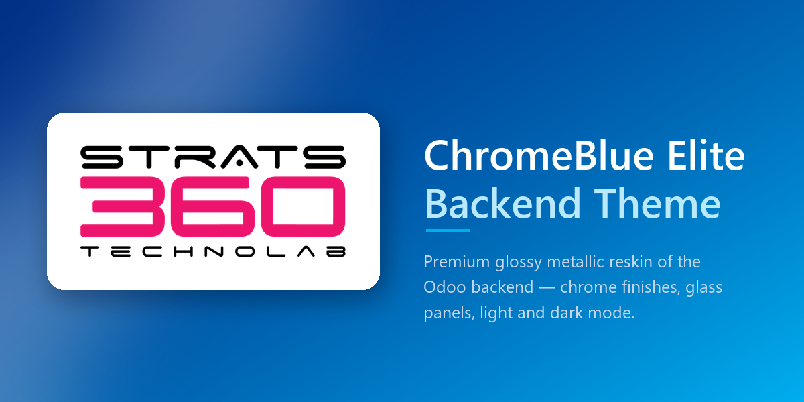

<p align="center">
  
</p>

<h1 align="center">BlueNova — Odoo 19 Backend Theme</h1>

<p align="center">
  
  
  
</p>

<p align="center">
  A premium visual reskin of the Odoo 19 backend — persistent app sidebar, light/dark mode,
  a themed login/signup/reset-password flow, an optional public home page, a KPI landing
  dashboard, and an in-app Settings screen for recolouring it all without touching SCSS.
  Technical name: <code>bluenova_backend_theme</code>.
</p>

---

## What it is

BlueNova restyles the Odoo web client and adds a handful of small, opt-in backend features on
top: a live colour picker under **Settings → Theme Settings**, a themed dashboard app, and matching
login/signup/public-home pages. Everything is additive and reversible — the module defines **no new
stored business data**. Its only persisted state is a `TransientModel` wizard (for importing a
colour preset) and a handful of `ir.config_parameter` rows and `ir.attachment` images that hold the
chosen palette. Uninstalling removes all of it and the backend returns to stock Odoo.

## Features

### Design system

| | |
|---|---|
| **Design tokens** | One set of `--cmt-*` CSS custom properties drives every colour, radius, shadow and font in the theme, declared in `static/src/scss/variables.scss`. |
| **Palette** | Deep Indigo `#3959b0` primary with Ocean Blue `#0284c7` accents over tiered white surfaces — fully overridable per-instance from Settings. |
| **Shape & elevation** | Rounded corners, soft multi-layer shadows and glassmorphic panels, cards and dropdowns. |
| **Typography** | Inter for UI text, Poppins for labels and numerics — both bundled in-module as latin-subset `woff2`, so there is no `fonts.googleapis.com` request and nothing breaks offline or under a strict CSP. |

### Interface

- **Persistent app sidebar** replacing Odoo's apps dropdown — every app the user can reach, always
  visible, with the current app marked by an accent spine. Toggled from the navbar's grid button;
  the open/closed state is remembered per browser (`cmt_apps_sidebar_open` in `localStorage`).
- **Bundled app artwork** — 55+ single-colour icons covering the standard Odoo apps, painted through
  a CSS mask so one icon set carries every state (rest, hover, active). Icons are matched by the
  app's module name (`static/src/js/apps_sidebar.js`), so the mapping keeps working regardless of
  the user's language. Apps with no bundled artwork fall back to their own Odoo icon, then to a
  neutral placeholder.
- **Light / dark mode** — switched from the sidebar footer, applied instantly, remembered per
  browser (`cmt_color_scheme` in `localStorage`). The palette hangs off a single `data-cmt-theme`
  attribute on `<html>`, so dialogs, popovers and tooltips (which Odoo portals out to `<body>`) are
  covered too. This is a separate mechanism from Odoo's own dark-mode cookie — it flips instantly
  with no server round-trip and no bundle rebuild.
- **Control panel as a page header**, retinted top navbar, glassmorphic kanban boards, and a CRM
  pipeline KPI banner computed entirely from data already in memory (no extra RPC). See **Known
  limitations** for the one surface deliberately left alone.
- **Responsive** — tablet and phone breakpoints mirroring Bootstrap's; below `md` the rail steps
  aside for Odoo's own slide-in app menu.

### Settings → Theme Settings

A full panel (`views/res_config_settings_views.xml`, backed by `models/res_config_settings.py`)
lets an admin recolour the theme without touching SCSS or rebuilding assets:

- Individual colour pickers for the core palette, top bar, search box, sidebar, active-app
  highlight, semantic colours (info/success/warning/danger) and the auth pages — each with a
  separate dark-mode counterpart where the surface needs one.
- An uploadable **sidebar brand image** and a **login background image** (light and dark), stored
  as `ir.attachment` records rather than in `ir.config_parameter`, so no base64 payload rides along
  on every request.
- **Hero typography controls** (title/lead size and weight) for the public home page.
- **Export / Import / Reset** — the current palette can be downloaded as a JSON preset, re-imported
  later (validated field-by-field before anything is written), or reset back to the compiled
  defaults in one click.
- Every colour is validated against a strict hex/`rgb()`/`rgba()` pattern before it is saved *and*
  again before it is rendered, since the value is interpolated into a `<style>` block served to
  every user.
- Changes apply on save via a page reload — no asset-bundle rebuild, no server restart.

### Themed dashboard

An optional landing page (`bluenova_dashboard` client action) showing KPI tiles — open
opportunities, quotations, RFQs, posted invoices, open tasks, transfers to process, active
employees — for whichever of those apps are installed. Each tile:

- is dropped silently if its model isn't installed or the current user can't read it;
- counts records as the **current user**, never `sudo()`, so record rules apply exactly as they
  do in the underlying list view;
- can optionally be set (under Settings) as the page a user lands on right after login.

### Themed login, signup and public pages

- The login, signup and reset-password screens (all built on `web.login_layout`) pick up the same
  palette, plus an optional brand logo and a tagline set from Settings.
- An optional themed public page at `/` for anonymous visitors — off by default, and it
  automatically stands down if the `website` module is installed, since that module owns `/`
  properly.

## Requirements

| | |
|---|---|
| Odoo | 19.0 (Community or Enterprise) |
| Depends | `web`, `base_setup` |
| Optional | `crm` — only for the CRM pipeline card restyle in `views/crm_lead_views.xml` (see below); every dashboard tile and every other feature degrades gracefully without it |

## Installation

```bash
# 1. Clone into your addons path
cd /path/to/odoo/custom-addons
git clone https://github.com/NandiniGohel/odoo_theme_backend.git bluenova_backend_theme

# 2. Restart Odoo with the addons path registered
./odoo-bin -c odoo.conf -u bluenova_backend_theme
```

> **Note** — the directory name must be `bluenova_backend_theme`; that is the module's technical
> name and the asset paths are absolute references to it.

Then in Odoo: **Apps → Update Apps List → search "BlueNova" → Activate**.

The module is listed as an application, so it gets its own card under Apps rather than hiding
behind the "Extra" filter. It never installs itself (`auto_install: False`) — dropping it in the
addons path changes nothing until someone activates it.

### While developing

SCSS is compiled server-side and cached in `ir.attachment`. To see edits without restarting:

```bash
./odoo-bin -c odoo.conf --dev=all
```

Otherwise bump the assets (Settings → Technical → Regenerate Assets Bundles) and hard-refresh.

## Usage

| Action | Where |
|---|---|
| Show / hide the app sidebar | Grid button in the top navbar |
| Switch light ↔ dark | Sidebar footer, bottom-left |
| Recolour the theme | Settings → Theme Settings |
| Open the KPI dashboard | Its own entry in the app sidebar (if enabled as the login landing page, it opens automatically) |
| Reset a client-side preference | Clear `cmt_color_scheme` / `cmt_apps_sidebar_open` from `localStorage` |

The sidebar and dark-mode preferences are client-side only — no server round-trip — so they apply
instantly and survive a reload. The Settings palette, brand images and dashboard preference are
server-side and shared by every user of the database.

## Customization

### Recolour from the UI (recommended)

Settings → Theme Settings covers every token that has a picker, with export/import/reset built in
— no code change or asset rebuild required. See **Settings → Theme Settings** above.

### Recolour the compiled defaults

For anything without a picker, every visual decision is a token in
[`static/src/scss/variables.scss`](static/src/scss/variables.scss):

```scss
:root {
    --cmt-primary: #3959b0;          // brand + primary actions
    --cmt-tertiary: #0284c7;         // status + secondary accents
    --cmt-bg: #f8f9fa;               // the main canvas
    --cmt-surface: #ffffff;          // cards, navbar, panels
    --cmt-text: #111827;
    --cmt-font-sans: 'Inter', …;
}
```

The dark palette is the same token set redeclared under `:root[data-cmt-theme="dark"]` in
[`dark_mode.scss`](static/src/scss/dark_mode.scss) — edit the two blocks in parallel and both
modes stay in step. Note that any token the Settings screen also exposes a picker for will be
overridden at runtime by a saved value; the SCSS default is only what a fresh install shows.

### Add an icon for your own app

Drop a single-colour PNG/SVG on a transparent background into
`static/src/image/icons/`, then map it in
[`static/src/js/apps_sidebar.js`](static/src/js/apps_sidebar.js) by the module part of the app's
xmlid:

```js
const ICON_BY_MODULE = {
    my_module: "my-icon.svg",
    // …
};
```

Matching on the module rather than the display name keeps the mapping working in every language.
Apps with no entry fall back to their own Odoo icon, then to `generic-app.svg`.

### Add a tile to the dashboard

Tiles are declared as plain data in the `_TILES` list in
[`models/theme_dashboard.py`](models/theme_dashboard.py) — model, domain, icon and the action to
open on click. A new entry follows the same read-access and try/except guards as the existing
ones, so a tile for a model that isn't installed, or that the viewing user can't read, is simply
dropped rather than shown broken.

## Project structure

```
bluenova_backend_theme/
├── __manifest__.py                    # assets registration, data files, depends
├── controllers/
│   └── main.py                        # opt-in login-redirect & public-home hooks on web.Home
├── models/
│   ├── res_config_settings.py         # Theme Settings fields, validation, runtime CSS, presets
│   └── theme_dashboard.py             # AbstractModel behind the KPI dashboard (no stored data)
├── wizard/
│   ├── theme_import_wizard.py         # validates & applies an uploaded JSON preset
│   └── theme_import_wizard_views.xml
├── security/
│   └── ir.model.access.csv            # ACL for the (transient) import wizard only
├── views/
│   ├── theme_styles.xml               # renders the saved palette into the backend page head
│   ├── auth_theme.xml                 # login / signup / reset-password styling & branding
│   ├── public_home.xml                # optional themed page at `/`
│   ├── home_dashboard_actions.xml     # dashboard client action + app menu entry
│   ├── res_config_settings_views.xml  # the Theme Settings panel itself
│   └── crm_lead_views.xml             # optional CRM pipeline card restyle — see below
└── static/
    ├── description/                   # app-store card: icon, banner, index.html
    └── src/
        ├── fonts/                     # Inter + Poppins, latin subset (OFL 1.1)
        ├── image/icons/               # bundled app artwork, one per Odoo app
        ├── scss/
        │   ├── primary_variables.scss # prepended to web._assets_primary_variables
        │   ├── variables.scss         # ← every design token lives here
        │   ├── fonts.scss             # @font-face, bundled not CDN
        │   ├── base.scss              # canvas, scrollbars, shared primitives
        │   ├── navbar.scss            # top bar, via --NavBar-* properties
        │   ├── apps_sidebar.scss
        │   ├── control_panel.scss
        │   ├── kanban.scss
        │   ├── stats_banner.scss
        │   ├── home_dashboard.scss
        │   ├── settings_page.scss
        │   ├── buttons_misc.scss
        │   ├── responsive.scss
        │   ├── auth_pages.scss        # login / signup / reset-password (frontend bundle)
        │   ├── public_home.scss       # the public `/` page (frontend bundle)
        │   └── dark_mode.scss         # loaded last; overrides every backend surface above
        ├── js/
        │   ├── theme_mode.js              # light/dark state + <html> attribute
        │   ├── apps_sidebar_state.js      # open/closed rail state
        │   ├── apps_sidebar.js            # the rail component + icon mapping
        │   ├── apps_sidebar_patch.js      # slots it into WebClient / NavBar
        │   ├── home_dashboard.js          # dashboard client action
        │   ├── crm_pipeline_stats.js      # KPI cards, computed in memory
        │   └── crm_pipeline_stats_patch.js
        └── xml/                        # OWL templates + inherited core templates
```

> `views/crm_lead_views.xml` restyles the CRM pipeline card (title + priority on one row, contact
> line, revenue and assignee in the footer). It is **not** registered in the manifest's `data`
> list, because loading it would make the theme hard-depend on `crm`. To enable it, add `crm` to
> `depends` and the file to `data`.

## How it works

The theme layers three techniques, in order of preference:

1. **Odoo's own custom properties** — `--NavBar-*`, `--Kanban-*` and friends are redefined rather
   than overridden, so core keeps control of layout and the theme only supplies colour.
2. **Bootstrap runtime variables** — retargeted at document and component level. Odoo 19 Community
   compiles with `$enable-dark-mode: false`, so Bootstrap's own `[data-bs-theme=dark]` block never
   exists; the dark palette re-seeds those variables instead.
3. **Direct overrides**, last resort — for surfaces Odoo compiles straight into SCSS literals that
   no runtime variable can reach.

Any colour saved under **Settings → Theme Settings** takes a fourth, higher-priority path: it is
rendered as a small `<style>` block directly into the page `<head>` (`views/theme_styles.xml`,
plus `auth_theme.xml` and `public_home.xml` for the unauthenticated surfaces), placed after the
compiled asset bundle so it wins the cascade — and regenerated straight from `ir.config_parameter`
on every page load, with no bundle rebuild involved.

Every dark-mode rule is scoped under the `data-cmt-theme="dark"` attribute, so light mode is never
in the cascade fight.

## Known limitations

- Odoo's slide-in app menu on small screens (below `md`) is left as-is.
- **Graph views stay light on purpose.** Odoo draws chart axis labels onto the canvas from JS,
  taking the colour from a cookie that Community pins to `"light"` server-side. Darkening the panel
  would put near-black text on a near-black background, so the chart is given an explicit light
  card instead.
- Dark mode covers this theme's surfaces plus the main list / form / kanban / dialog chrome.
  Deeper corners — some reports, iframes and third-party widgets — can still show light patches.
- The public home page has no drag-and-drop editing; it renders the company's own data plus the
  Settings tagline. Anything richer is what the `website` module is for, and this theme stands
  down automatically once `website` is installed.
- No fixed bottom footer bar and no floating action button.

## Uninstall

Apps → BlueNova Backend Theme → Uninstall. The backend returns to stock Odoo immediately. The
module owns no business models or records — only the Theme Settings wizard's transient model, the
`ir.config_parameter` rows holding the saved palette, and the `ir.attachment` rows holding the
uploaded images, all of which go with it.

## License

[LGPL-3.0](https://www.gnu.org/licenses/lgpl-3.0.html).

Bundled fonts — Inter and Poppins — are under the
[SIL Open Font License 1.1](https://openfontlicense.org/).